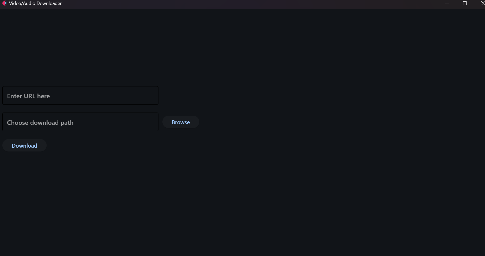
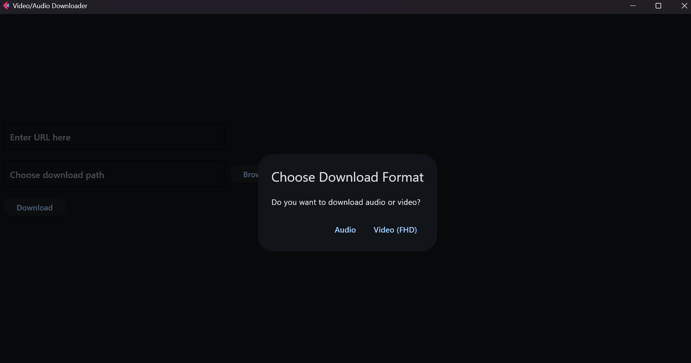

# Video/Audio Downloader

This is a Python-based application that allows you to download video or audio from various platforms like YouTube. It uses `Flet` for the GUI and `yt-dlp` for downloading content.




## Features

- Download videos in FHD (1080p) resolution.
- Download audio in MP3 format with 192kbps quality.
- Choose your download directory.
- Progress bar and download speed display.

## Usage

-Enter the video or audio URL.
-Choose the download path by clicking the "Browse" button.
-Click the "Download" button and select whether you want to download audio or video.
-The progress bar will show the download progress, along with the download speed and ETA.

## Installation

### Clone the Repository

```bash
git clone https://github.com/yourusername/Video-Audio-Downloader.git

### Move the file

```bash
cd Video-Audio-Downloader

### Install Dependencies

```bash
pip install -r requirements.txt

### Run the Program

```bash
python index.py

